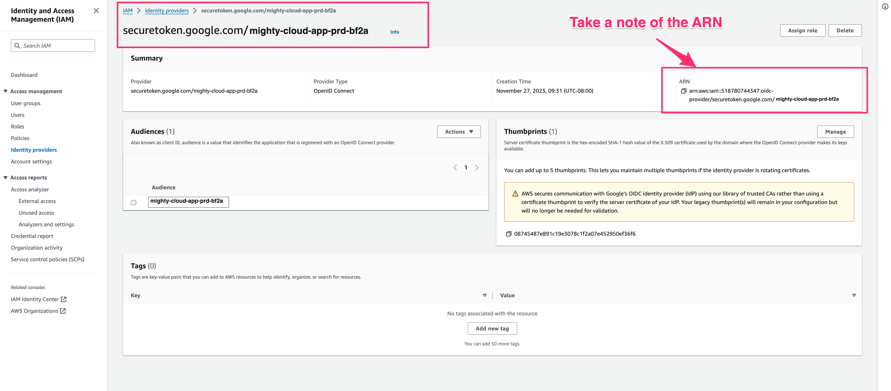
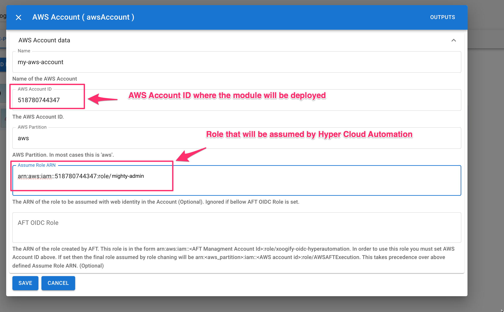

# OIDC Provider

Setting up the OIDC provider will allow Hyper Cloud Automation to authenticate to your AWS Account without use of AWS Access Keys. OIDC Provider will allow Hyper Cloud Automation to authenticate using JWT Tokens.

## Setup OIDC Provider and Role

1. Log in to your AWS Account
1. Go to IAM
1. In the left navigation menu click on **Identity Providers**
1. On the right click **Add provider** button
   
1. Set the following:
   1. Provider type: OpenID Connect
   1. Provider URL: https://securetoken.google.com/mkv-xoogify-web-app-4b0e
   1. Audience: **mkv-xoogify-web-app-4b0e**
   1. Click on **Add Provider**
      
1. You should see **securetoken.google.com/mkv-xoogify-web-app-4b0e** in the list of providers.
1. Click on **securetoken.google.com/mkv-xoogify-web-app-4b0e** and note down the ARN.
   
1. In the left navigation menu click on **Roles**
1. In the right corner click on **Create Role** button
1. Select **Custom Trust Policy** and set the policy to be like this:
   ```json
   {
     "Version": "2012-10-17",
     "Statement": [
       {
         "Effect": "Allow",
         "Principal": {
           "Federated": "arn:aws:iam::<YOUR AWS ACCOUNT ID>:oidc-provider/securetoken.google.com/mkv-xoogify-web-app-4b0e"
         },
         "Action": "sts:AssumeRoleWithWebIdentity",
         "Condition": {
           "StringEquals": {
             "securetoken.google.com/mkv-xoogify-web-app-4b0e:aud": "mkv-xoogify-web-app-4b0e",
             "securetoken.google.com/mkv-xoogify-web-app-4b0e:sub": "<Hyper Cloud Automation UID>"
           }
         }
       }
     ]
   }
   ```
   where:
   1. `<YOUR AWS ACCOUNT ID>` is the ID of the AWS Account where your are creatint this role (same account where OIDC Provider is created)
   1. `<Hyper Cloud Automation UID>` is your user UID in Hyper Cloud Automation. You can find this value in [Profile](../../Concepts/Profile.md) page.
      :::info
      You can specify an array of UIDs as well. For example `"securetoken.google.com/mkv-xoogify-web-app-4b0e:sub": ["uid1", "uid2", "uid3"]`
      :::
      :::warning
      It is very important to set UID value in the above policy. Do not leave it blank
      :::
      
1. Press **Next**
1. Add `Administrator Access` permission.
   
   :::info
   Using `Administrator Access` is a broad policy best suted to deploy any kind of resource in your AWS account. If this is too broad you can set the permissions to other less broad roles.
   :::
1. Press **Next** button
1. For role name enter **xoogify-admin**.
1. For description enter "Xoogify Hyper Cloud Automation Federated Role"
   
1. Press **Create** button
1. **Note down the ARN of the created role. You will need it in the next section**
   

## Use OIDC Role in Hyper Cloud Automation

This is an example of how you can use the above created role

1. Go to https://app.xoogify.com
1. Click on the [Environments](../../Concepts/Environment.md) in the left navigation menu
1. Click on **Add Enironment** button and give it a name
1. Add `AWS Account` to the environment tree
   
1. Click on **_Config_** button of the `AWS Account` (it looks like three dots)
1. Set the following:
   1. Name: Your AWS account name (can be anything but it's good to match the actual account name).
   1. AWS Account ID: Must be valid account ID. In this tutorial it should match the account ID where the OIDC role is created in the [Setup OIDC Provider and Role](#setup-oidc-provider-and-role) section.
   1. Assume Role ARN: The arn of the role created in the last step of the [Setup OIDC Provider and Role](#setup-oidc-provider-and-role) section.
      
1. Press **Save** Button
1. Add `AWS Region` to the `AWS Account` and set it to whatever region you want (For example: us-west-2)
1. Add `AWS S3 Bucket` to the `AWS Region`
1. Open [Module Config](../../Concepts/Module.md#module-config-button) and set the name of the bucket.
1. Scroll down and press **Save**
1. You should have something like this:
   
1. You can start deploying the module. See [Modules](../../Concepts/Module.md) for more details.
