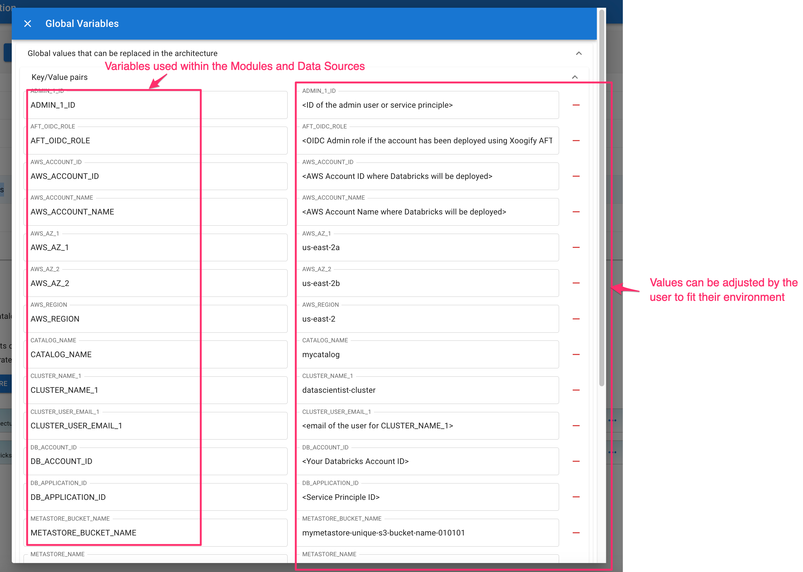

# Architectures

Architectures are templates that can be used to create [Environments from library](./Environment.md#creating-envrionment-from-library). Architectures look like Environments but the difference is that they don't have deploy action buttons like `plan`, `apply`, and `destroy`. The Architectures that you create are available to your organization only. Architecture are meant to be a utility for the users to quickly get started with their environments.

:::warning
Current [Environments](./Environment.md) can't be upgraded with Architectures. Architectures are meant to be used only to create the Environments"
:::

## Architecture Designer

Architecture designer can be accessed by clicking on `Architecture Designer` in the Navigation menu on the left side of the screen.

- `Add Architecture` button will create a new architecture
- `Copy Architecture` button will create a new architecture based off the current working architecture
- All architectures for your organization are listed in the table view
- You can change the architecture name by clicking on the pencil button next to the architecture name in the table
- You can delete the architecture by clicking on the delete button in the `Action` column in the table
- Click on `Description` text box to give a short description of the architecture. This will be visible when user [loads the environment from the library](./Environment.md#creating-envrionment-from-library)
- Click on `Details` text box to give more detailed explanation of the architecture

:::info
Only Admin users can create/modify/delete architectures. Editors can view the Architectures but they can't make anychanges to them
:::

## Creating Architecture Tree

Just like in the [Environment](./Environment.md) keep adding [Modules](./Module.md) and [Data Sources](./DataSource.md) to the tree. You can add elements to the tree by pressing the `+` button and remove the elements by pressing `-` button.

:::tip
Rather then hardcoding the values in the [Modules](./Module.md) and [Data Sources](./DataSource.md) it is better to define Global variables at the root level and then use those variables within the [Modules](./Module.md) and [Data Sources](./DataSource.md). That way a user can adjust the global variables in one spot instead of searching the elements individually. Here is an example of Global Variables for `Example AWS Databricks` Architecture

:::
