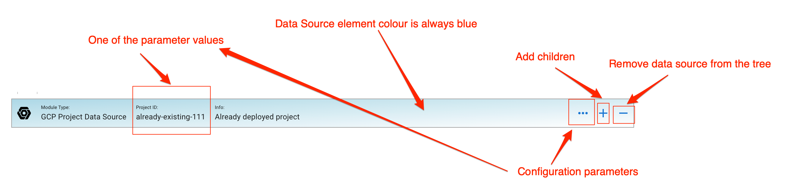
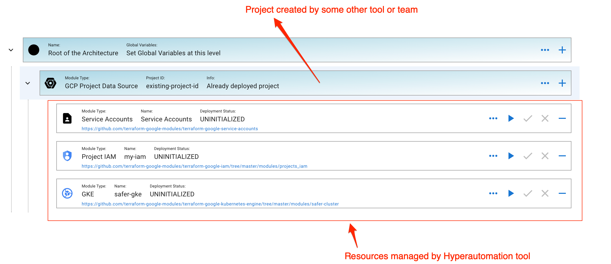

# Data Sources

Data Sources looks like [Modules](./Module.md) but the difference is that these elements are not deployable. These elements are the containers for the already deployed elements in the architecture. Example of data source is a `GCP Project Data Source` or `AWS Account`. Paramaters set in the data sources are availabe to the children. Children of Data Sources can be [Modules](./Module.md) or other Data Sources.

Data Sources are very usuful if you already have some cloud sources deployed. For example, if you would like to use Hyper Cloud Automation to manage GKE cluster and you have GCP projects deployed by other tools or teams then this would be a good use case to use data source. In that case your environment can look like this:

