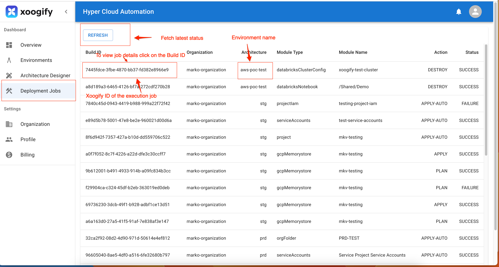

# Deployment Jobs

The Deployment Jobs page in the Xoogify web application serves as a hub for users to monitor their deployment jobs across different environments and architectures. This page provides detailed insights into each job's status, facilitating efficient tracking and troubleshooting.

## Page Layout and Features

The Deployment Jobs page includes several key components to help users manage their deployments:

- `REFRESH` Button
  - Purpose: Allows users to update and fetch the latest status of their deployment jobs.
  - Usage: Click the `REFRESH` button at the top of the page to reload job statuses.
- `Build ID`
  - Purpose: Provides a unique identifier for each deployment job.
  - Usage: Click on a Build ID to view job exection logs.
- `Environment Name`
  - Description: Indicates the environment where the deployment job was executed, such as 'aws-poc-test' or 'stg'.
- `Organization`
  - Description: Shows the organization name associated with the deployment job, helping users identify jobs within multi-organization setups.
- `Module Type`
  - Description: Describes the architecture and type of module used in the deployment job.
- `Module Name`
  - Descrption: Displays the name of the module that was the subject of the deployment.
- `Action`
  - Description: Lists the action that was taken in the deployment job, such as `APPLY-AUTO`, `DESTROY`, `PLAN`, or `APPLY-AUTO`.
- `Status`:
  - Description: Shows the current status of the deployment job, indicating whether it was a `SUCCESS` or `FAILURE`

### Understanding Job Status

- `SUCCESS`: Indicates that the deployment job completed without errors.
- `FAILURE`: Implies that the job encountered issues. Users should click on the Build ID for detailed error information and troubleshooting steps.
- `IN-PROGRESS`: Implies that the job is being scheduled for execution
- `WORKING`: Implies that the job is currently being executed by the system
