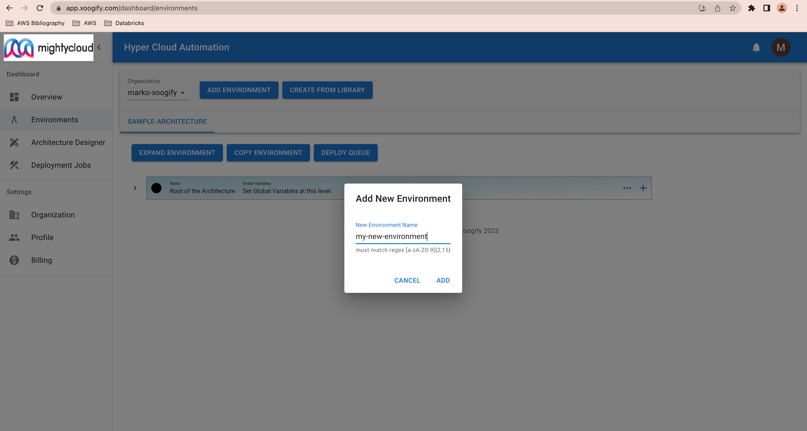
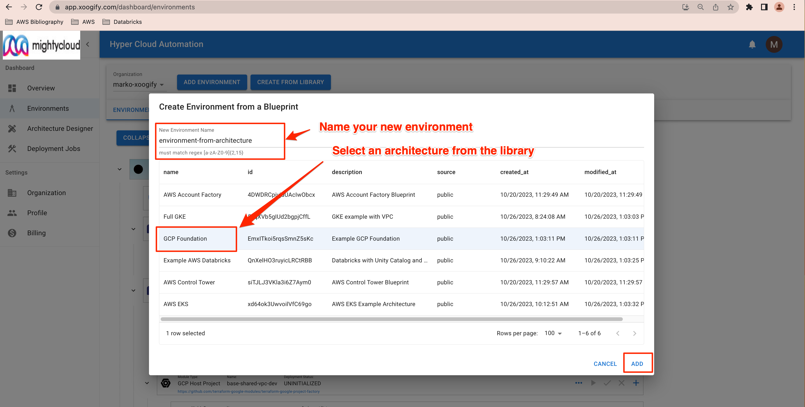

# Environment

Environmnet groups [terraform modules](../Concepts/Module.md) into logical dependency tree. Environments visually describe how your infrastructure looks like and how it is created using terraform modules. Most of the infrastructure management is done through the environments.

Environment is also an isolated group of modules. Modules from one environment can not interract with the modules from different environment

## Creating Envrionments

There are two ways of creating environments:

- Create from scratch
- Create from Library

### Creating environment from scratch

1. In the navigation section click on "Environments"
1. In the top bar click on "Add Environment" button
   
1. Enter the name of your new environment
   
1. Select the new environment in the tab panel
   

At this point you are ready to populate your environment with [terraform modules](../Concepts/Module.md) and [data sources](../Concepts/DataSource.md)

### Adding/Removing Modules

1. Press `+` button at the root of the environment to open a pop up menu of the available terraform modules.
   
2. Keep adding various infrastructure modules by pressing `+` and selecting modules from the pop up menu.
   :::tip
   Click on "Expand Environment" to see the full layout
   :::
3. To remove a module from the environment tree press `-` button on the [module](../Concepts/Module.md) or [data source](../Concepts/DataSource.md)
   

## Creating envrionment from Library

Creating an environment from scratch is more suited for advanced operations engineers that are familiar with publicly available terraform modules (see https://registry.terraform.io/browse/modules). Much easier way is to create an environment from an architecture from the library

1. In the navigation section click on "Environments"
1. In the top bar click on "Create From Library" button
   
1. Give name to your new environment and select architecture from the list
   
1. Select the new environment in the tab
   :::tip
   Click on "Expand Environment" to see the full layout
   :::
1. Open the global settings for the environment at the root of the tree
   
1. Set Global Variables values to fit your environment
   

## Next Steps

Once you have the environment created you can start deploying modules. If you [created the environment from scratch](#creating-environment-from-scratch) then you should probably set inputs for the modules before trying to deploy. If you [created the environment from the library](#creating-envrionment-from-library) and you set the global variables then you can start deploying the modules.
