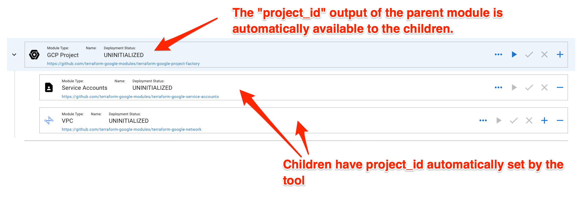
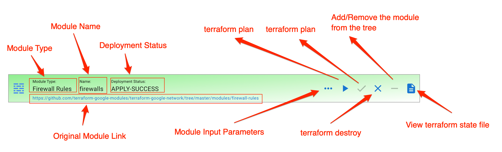
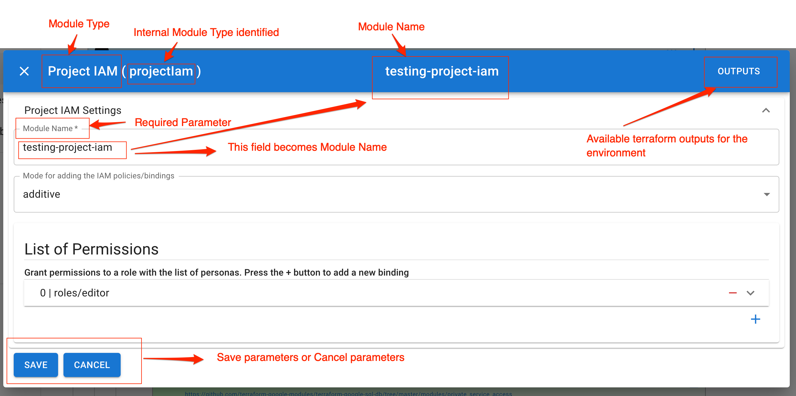
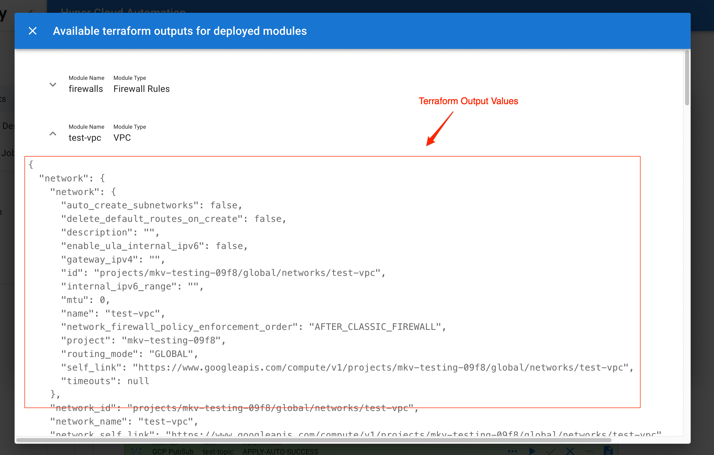
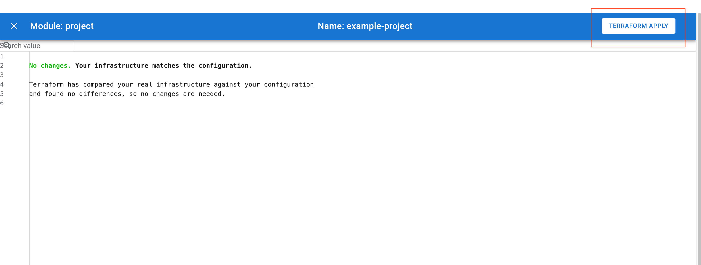

# Modules

Modules are the core of the Hyperautomation tool. Modules are part of the environment tree and they directly correspond to publicly availabe terraform modules. Modules are executable/deployable units of the environments. Modules don't create a new terraform code but rather they only set the input parameters defined in `variables.tf` of the module.

You will notice that modules are part of the environment tree. That means that some outputs of the parent modules will be automatically available to the childre of the module. The best example would be a `GCP Project` module. One of the outputs of the `GCP Project` is `project_id`. The value of this output is automatically available to children automatically. This means that in some module settings in the tree you will not see all the input parameters available in the original module's `variables.tf`. The tool will automtically apply appropriate parent outputs as input values of the children.

## Module elements

The module has the following elements:

1. Module Type
1. Module Name
1. Deployment Status
1. Module Config button
1. Terraform Plan button
1. Terraform Apply button
1. Terraform Destroy button
1. `Add` a child button
1. `Remove` module from the tree
1. Terraform State button
1. Link to the Terraform Module

### Module Type

Module Type is the type of the terraform module. It is a way to recognize the type of the module in the tree. You can have multiple modules of the same type in the tree.

### Module Name

Each module should have a unique name. The name is usually set by a one of the first parameter inputs of the module..

### Deployment Status

Module can have one of the following statuses:

1. `UNINITIALIZED` - The module has been added to the tree and no terraform action has been performed.
1. `IN-PROGRESS` - The module is sent to the queue for exection
1. `PLAN-FAILURE` - `terraform plan` has failed
1. `PLAN-SUCCESS` - `terraform plan` has succeeded
1. `APPLY-FAILURE` - `terraform apply` has failed
1. `APPLY-SUCCESS` - `terraform apply` has succeeded
1. `DESTROY-FAILURE` - `terraform destroy` has failed
1. `DESTROY-SUCCESS` - `terraform destroy` has succeeded
1. `APPLY-AUTO-FAILURE` - `terraform apply -auto-approve` has failed
1. `APPLY-AUTO-FAILURE` - `terraform apply -auto-approve` has succeeded

### Module Config Button

Clicking on `Module Config` button will open a Dialog with module input parameters. Parameters marked with `*` are mandatory.

#### Terraform Outputs

When you click `Outputs` button in the `Module Config` Dialog you will get the terraform outputs of all the deployed modules in the [Environment](./Environment.md). This is a utility that allows you to find the infrastructure values of the deployed resources. This is very useful if you need to fill up the parameter value with very specific infrastructure values like `self_link` or `arn`.

This feature is indtended for advanced users

### Terraform Plan

This button will start `terraform plan` command for the module. The input paramters from [Module Config](#module-config-button) will be passed as inputs to the module. If the action is succesfull a plan will be created.

### Terraform Apply

This button will open `Terraform Apply` view in which you can apply the plan generated by [Terraform Plan](#terraform-plan) command.

### Terraform Destroy

This button will open a dialog displaying the plan to be destroyed. By clicking the `Terraform Destroy` button you will kick start `terraform destroy` command.

### Add Button

Add button will add a child to the tree. List of children is based on the parent type. Hyperautomation tool keeps the dependency tree curated so that the modules can be added to the tree in a meaningul manner without causing cycling dependencies.

### Remove Button

Remove button will remove the module from the tree. Remove can be performed only if the module is in `UNINITIALIZED` or `DESTROY-SUCCESS` state.

### Terraform State Button

This button becomes visible once the module enters `APPLY-SUCCESS` state for the first time. This button will show the output of `terraform show` command.

### Link to the module

This is a link to module source code. This is usuful if you want to know more about the module being deployed.
