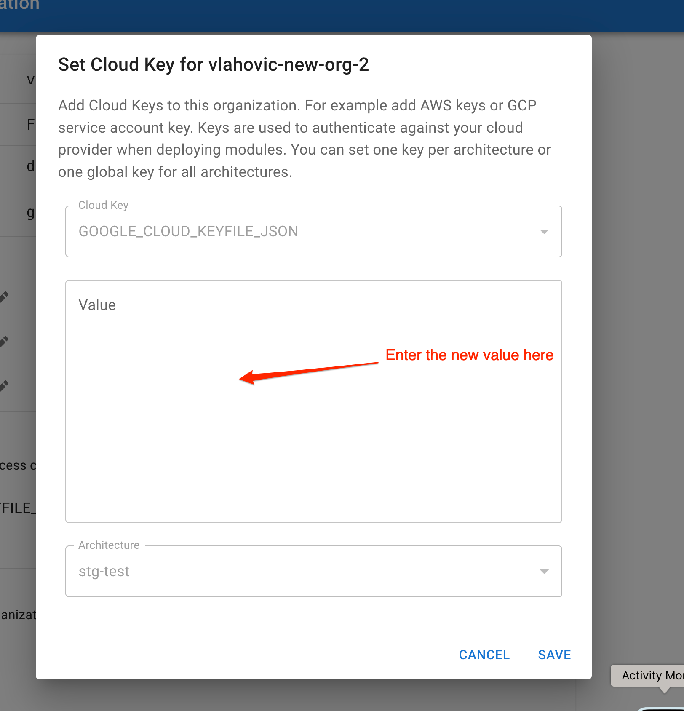

# Organization

When you login for the first time into the Hyperautomation Tool an `Organization` will be generated for you. Through Organization you can:

- See other `Organizations` you belong to
- See Billing Plan
- Delete/Rename [Environments](./Environment.md)
- Add/Remove [Cloud Keys](#cloud-keys)
- Add/Remove [Team members](#inviteremove-team-members)
- See assigned GCP bucket for Terraform State Files and Logs
- Change Organization Name

## Change Organization Name

To change your `Organization` name press on `Change Name` button and enter the new name.

:::info
Only Admin users can change the organization name.
:::

## Rename/Delete Envrionments

You can rename the environments by pressing a `pencil` button next to the environment. To delete an environment click on `delete` button.

:::warning
You can only delete and environment that doesn't have any modules deployed in it.
:::

:::warning
Only Admin can change/delete environments
:::

## Invite/Remove Team Members

In the Team section you can Invite members to your organization or remove them. Invited members will be granted `Editor` role. Invited members can accept their invitations through the Profile page.

## Cloud Keys

`Cloud keys` refer to the access keys or credentials used to authenticate to a cloud service provider. These could come in the form of an API key, a JSON file, or a series of tokens. They are essential for securely connecting, managing resources, and performing operations within cloud platforms like AWS, GCP, Azure, etc., in a way that adheres to the principle of least privilege.

Cloud Keys are used by [Modules](./Module.md) to deploy terraform resources to your Cloud.

:::info
Only Admin can Add/Edit/Remove the kyes
:::

### Adding a Cloud Key

1. Press on the `+ADD` button.
1. Select the type of the key. Available types:
   - `GOOGLE_CLOUD_KEYFILE_JSON` - See how to create a GCP [Service Account Key](https://cloud.google.com/iam/docs/keys-create-delete#iam-service-account-keys-create-console).
   - `AWS_ACCESS_KEY_ID` and `AWS_SECRET_ACCESS_KEY` - See how to create AWS access keys [here](https://docs.aws.amazon.com/IAM/latest/UserGuide/id_credentials_access-keys.html).
   - `DATABRICKS_CLIENT_SECRET` - See how to create a [Service Principle OAuth secret](https://docs.databricks.com/en/dev-tools/authentication-oauth.html) in your Databricks organization
1. Assign the key to the environement or set it as `global`.
   - If set to `global` all [Environments](./Environment.md) will use this key to deploy [Modules](./Module.md)
   - If assigned to a specfic [Environmnet](./Environment.md) then this key will be used to deploy only [Modules](./Module.md) in that environment.

:::info
Added key is encrypted using a KMS key. Once the key is added you will not be able to check the original value.
:::

### Editing the Key

To edit the key press the `Pencil` button next to it and the Edit dialog will open.

Once the dialog is open put in the new value for the key.

:::info
You can not see and modify the old value of the key. You can only enter the new key.
:::

### Deleting the Key

To delete the cloud key press `Delete` button next to it. The key will be permanently removed from the system.

## GCS Bucket

GCS bucket is created along with your organiazation. Only your organization has access to your GCS bucket. GCS bucket is used for:

1. Storing terraform state files. Each [Module](./Module.md) in the [Environment](./Environment.md) is stored in `gs://mkv-tf-{Organization ID}/{Environment ID}/{Module ID}/default.tfstate`
1. Storing Terraform Plans. `gs:///mkv-tf-{Organization ID}/{Environment ID}/{Module ID}/plan/`
1. Storing Execution Logs. `gs:///mkv-tf-{Organization ID}/logs/`
