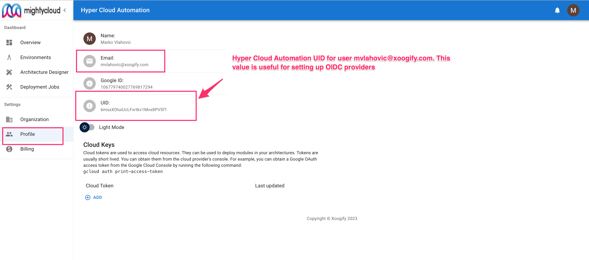
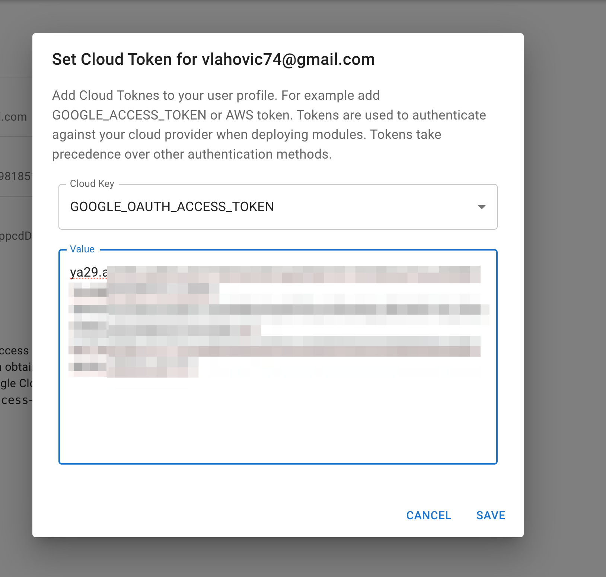

# Profile

The Profile page in the Xoogify web application provides personal details and cloud configuration options for the user. It is designed to allow users to see their personal information and cloud resources for deploying modules within their architectures.

## Profile Information

The Profile section displays the following user details:

- Name: The full name of the user as registered on the platform.
- Email: The email address associated with the user account.
- **UID**: The unique identifier for the user within the Xoogify system.
  

:::info
**_UID_** can be used to identify users in with OIDC systems in your cloud. For example, this value can be used to identify users when setting up [OIDC providers in AWS](https://docs.aws.amazon.com/IAM/latest/UserGuide/id_roles_providers_create_oidc.html)
:::

## Dark/Light Mode

Users can toggle between Light Mode and Dark Mode for the interface display according to their preference.

## Cloud Tokens

Cloud tokens are utilized to access cloud resources and deploy modules in your architectures. These tokens are typically short-lived for security purposes. This can be particullarly usefule if you don't have [Cloud Keys](./Organization.md#cloud-keys) set yet and you want to use a short lived Oauth access tokens.

Example:
In GCP you can obtain Access Token for your user by doing this command in your cloud shell.

```sh
gcloud auth print-access-token
```

To add the token, press `+Add` button and put the token into the form.


:::info
Once the access token is created you can not view it's value anymore. The token is encrypted using KMS.
:::

:::warning
Access Tokens take precedence over [Cloud Keys](./Organization.md#cloud-keys)
:::

## Accept Team Invitations

On this page you can accept invitiations to join other organizations and teams.
