import {
PlayArrow,
MoreHoriz,
Remove,
Add,
Clear,
Description,
Check,
} from "@mui/icons-material";

# AWS Example: deploy s3 bucket

In this quick start we will show you how you can use `Hyper Cloud Automation` to deploy an s3 bucket. The example will walk you through creating a simple environment, adding a module, and deploy it.

## Prerequiste

In your aws account create a user with the S3FullAccess policy and upload the access keys to the Hyper Cloud Automation.

1. Login to your AWS account
2. Go to IAM
3. Create a user called **xoogify-automation**
   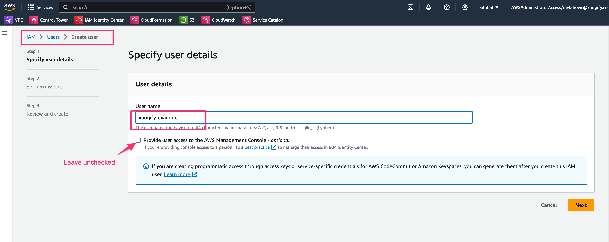
4. Assign the user AmazonS3FullAccess Policy
   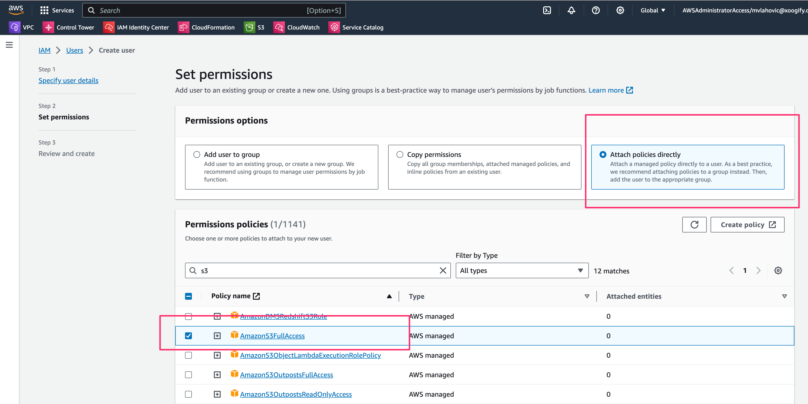
5. Review and `Create user`
   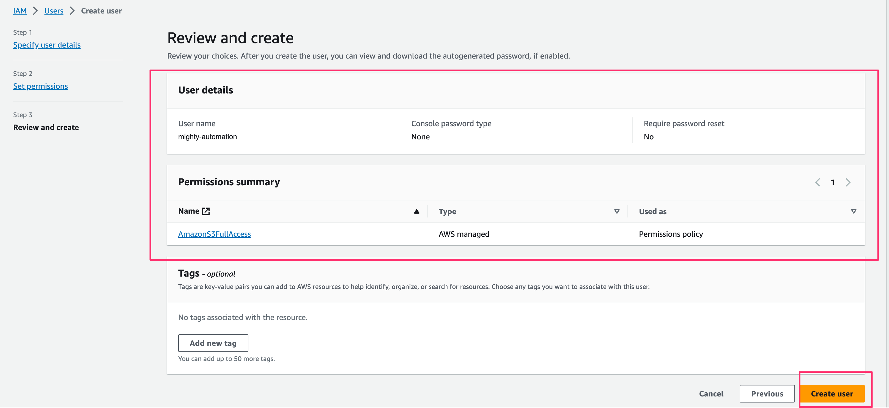
6. Go to the new user and create access key.
   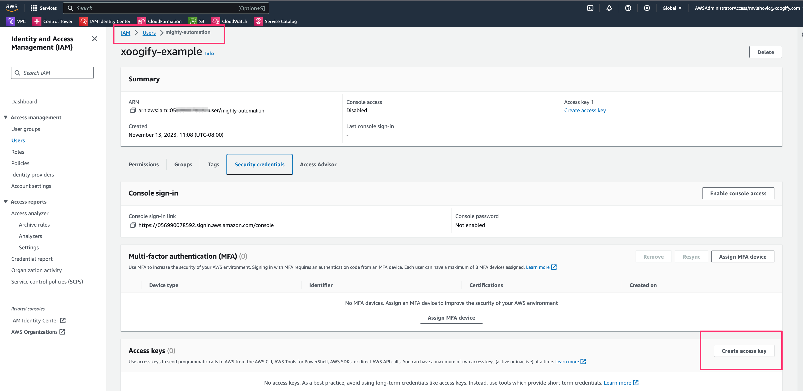
7. Select `Third Party Service` in the list and ignore the warning (make sure to checkmark `I understand the above recommendation and want to proceed to create an access key.`)
8. Press `Next`
9. Press `Create Access Key`. Note down the values for `Access Key` and `Secret Access Key`
10. In the Hyper Cloud Automation click on [Organization](../Concepts/Organization.md) in the left hand navigation menu.
11. Scroll to the [Cloud Keys](../Concepts/Organization.md#cloud-keys) section.
12. Press on `+Add` button.
    1. For `Cloud Key` choose `AWS_ACCESS_KEY_ID`.
    1. Paste the value of the `AWS_ACCESS_KEY_ID` from step 9
    1. For `Environment` choose global.
    1. Press `Save` button
    1. Repeat the above steps for `AWS_SECRET_ACCESS_KEY`
13. You should have something like this
    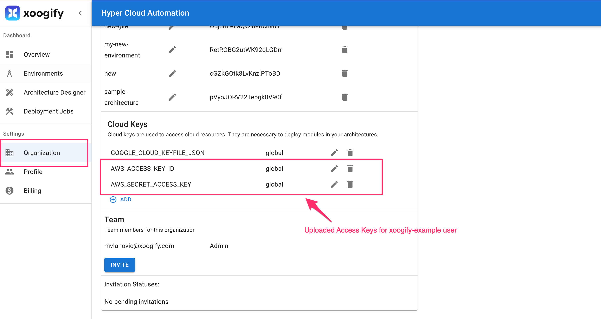

## Create environment

In this example we will create a simple environment which consist of a module that deploys an S3 bucket.

1. In the left naviation menu select `Environments`
1. Click on `Add Environment`
1. Name your environment `example-s3-environment`
1. Press `Add`
1. Select `EXAMPLE-S3-ENVIRONMENT` in the tabs
1. Press on the `+` button in the `Root of the Environment`
1. Select `AWS Account` [Data Source](../Concepts/DataSource.md)
   :::tip
   Press `Expand Environment` button to expand/collapse the tree
   :::
1. In the `AWS Account` node press on the <MoreHoriz width="30"/> button and fill in the following
   1. `Name` - name of your AWS Account (required)
   1. `Account ID` - ID of your AWS Account (required)
   1. Press `Save`
      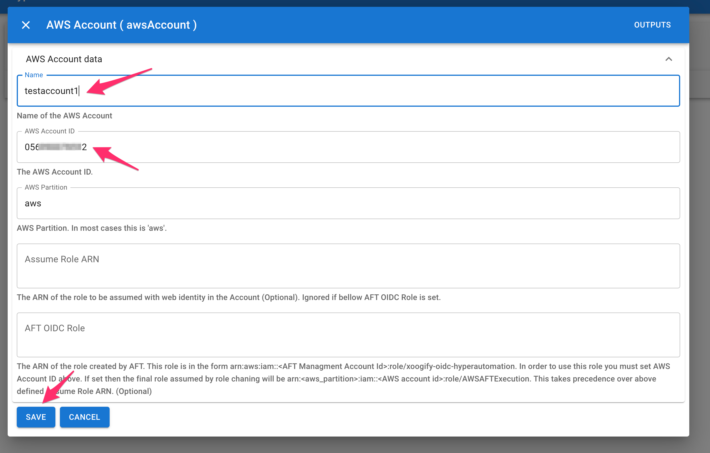
1. On `AWS Account` node press <Add width="30"/> and select `AWS Region` [Data Source](../Concepts/DataSource.md)
1. Click on <MoreHoriz width="30"/> button and set the region to `us-west-2` and press `Save`
1. On `AWS Region` node press <Add width="30"/> and select `AWS S3 Bucket` [Module](../Concepts/Module.md)
1. Click on <MoreHoriz width="30"/> button to enter the settings for the bucket
   1. You only need to set the `Bucket Name`. (Example: `my-xoogify-hyper-cloud-automation-bucket-57`)
   1. Scroll all the way down and press `Save`

Your first simple environment should look something like this:
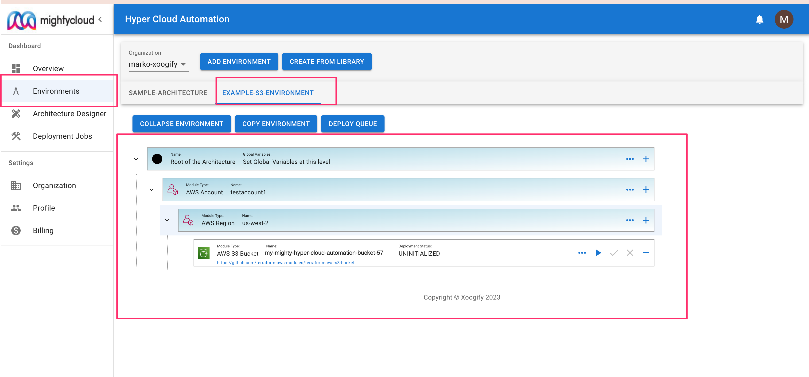

## Deploy

Deployment process consists of running a `plan` action folowed by approval process and then running `apply`

1. In your environment locate `AWS S3 Bucket` module
1. Press on the <PlayArrow width="30" /> in the module to start the `plan`. Notice that the `Deployment Status` will change.
   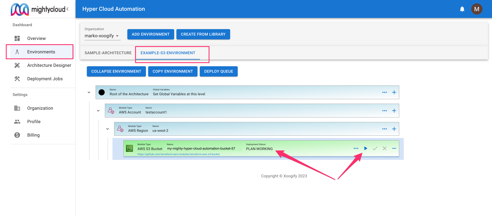
1. Once the `Deployment Status` is changed to `PLAN SUCCESS` click on <Check width="30"/> button to pop up the deployment `PLAN`
1. In the top right corner press `TERRAFORM-APPLY` button
1. Wait for deployment to finish.
   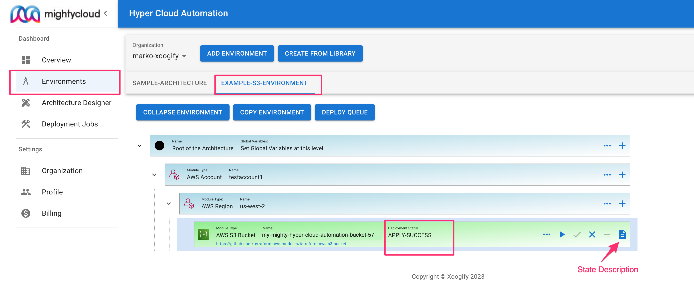
1. You can review the state file as in the image above
1. Go to your AWS Console
1. Go to S3
1. You will find the bucket that has been deployed

To review deployments log do:

1. In the left navigation menu click on `Deployment Jobs`
1. Click on the deployment job IDs to see the full logs
   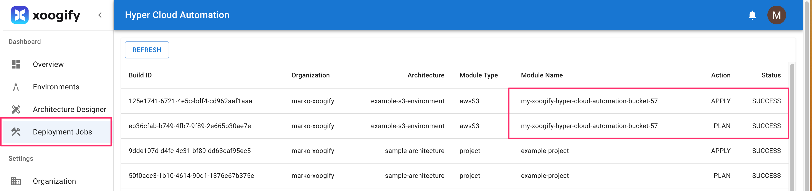

## Destroy the bucket

1. In the naviagion menu on the left select `Environments`
1. In the tabs select `EXAMPLE-S3-ENVIRONMENT`
1. Click on `Expand Environment`
1. Click on <Clear width="30" /> button on the `AWS S3 Bucket` module.
1. Confirm the destruction plan
1. Wait for `Destroy` to complete
   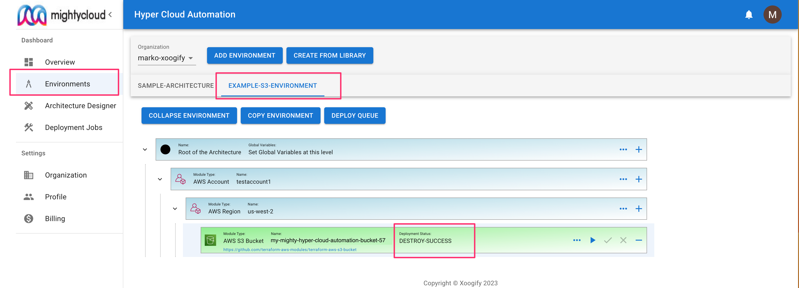
1. Go to your AWS Console
1. Go to S3
1. The bucket should be removed

## Cleanup

1. In the left navigation menu click on `Organization`
1. Delete the environment `EXAMPLE-S3-ENVIRONMENT`. See also [delete environment](../Concepts/Organization.md#renamedelete-envrionments)
1. Delete the AWS user and access key created in [prerequisite](#prerequiste)
