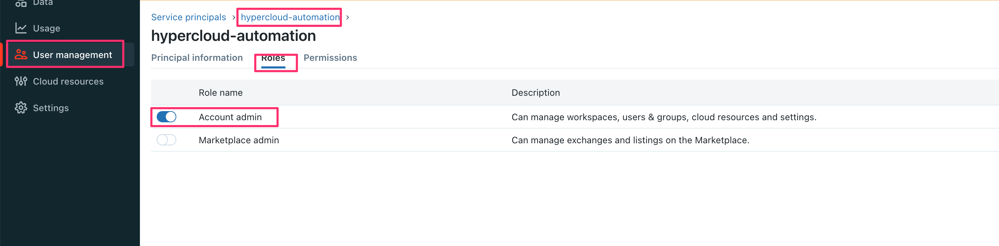
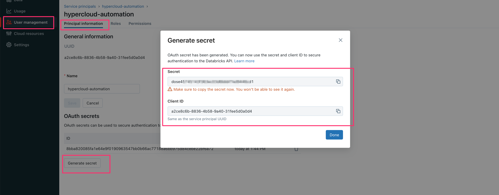
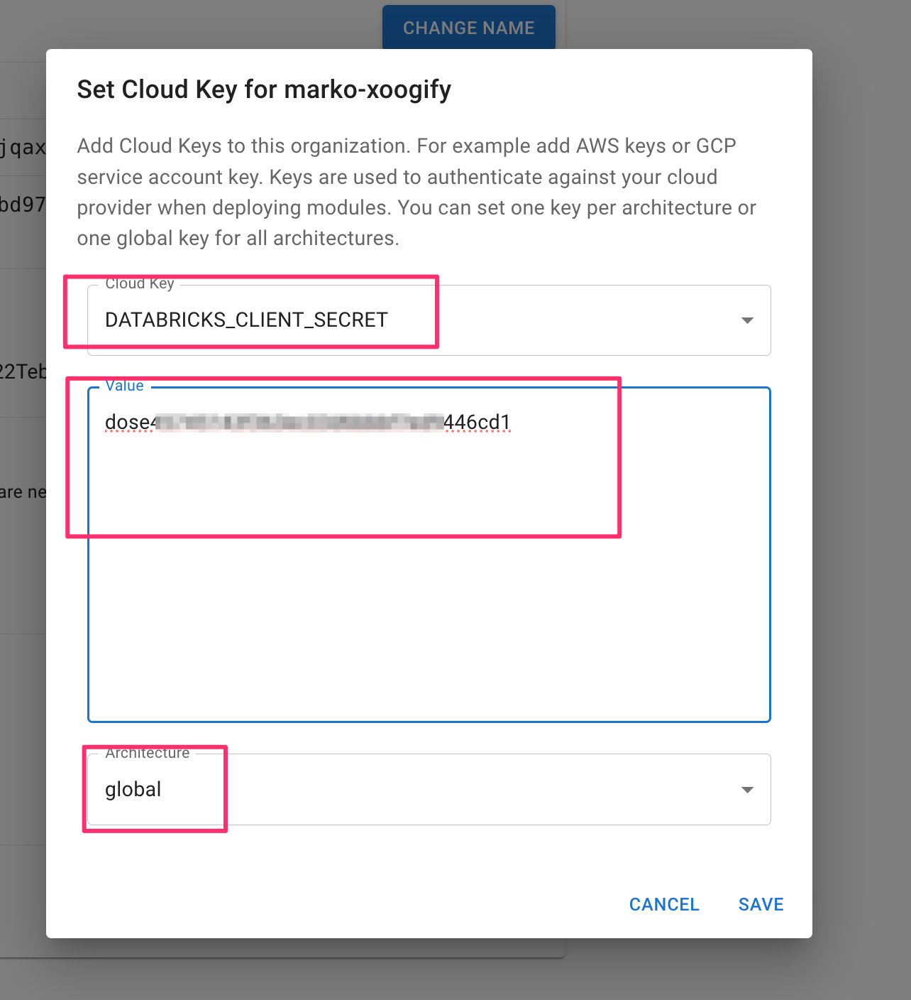
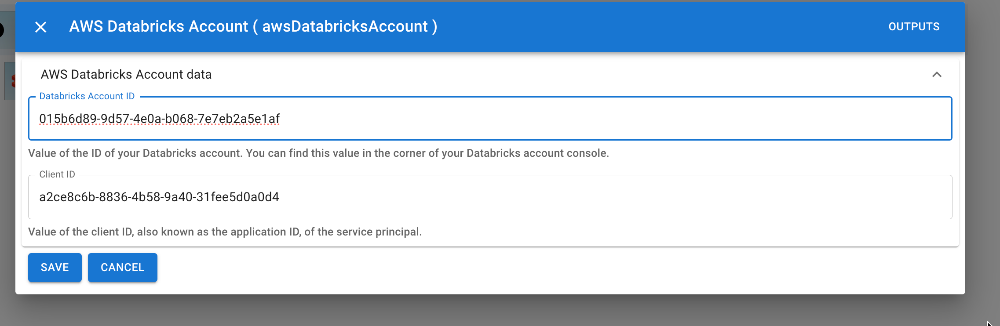
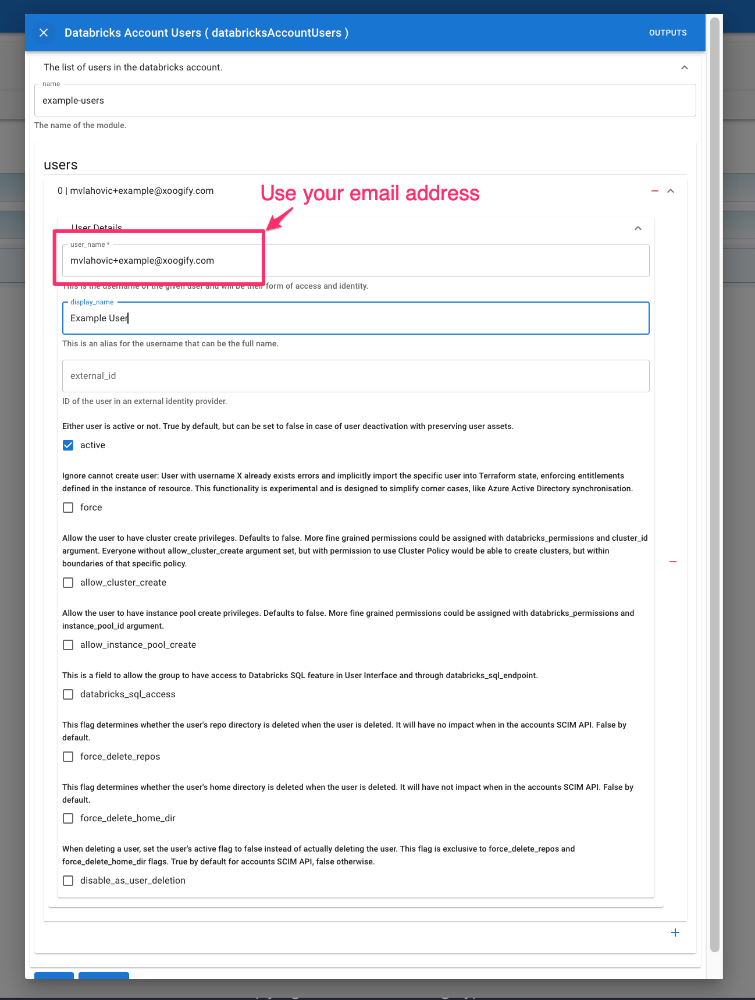
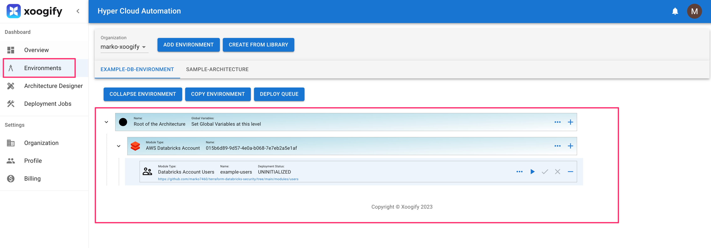
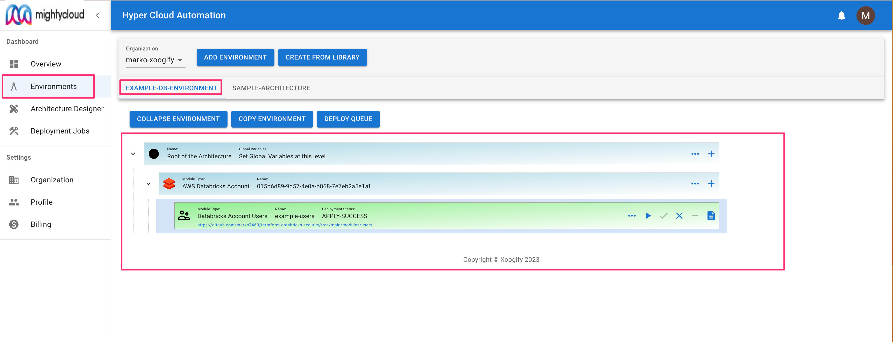
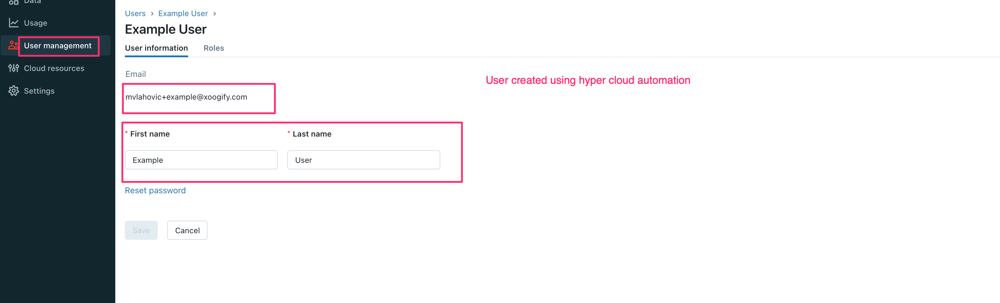
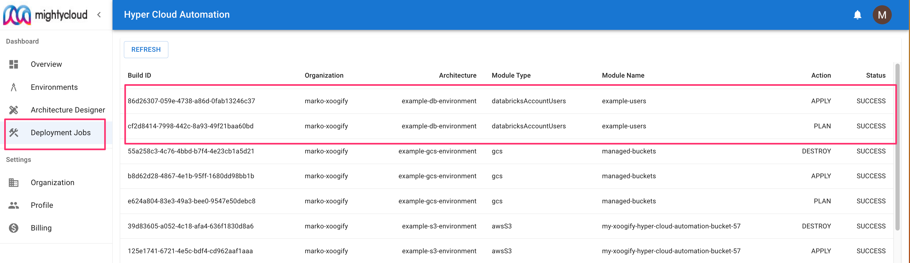

import {
PlayArrow,
MoreHoriz,
Remove,
Add,
Clear,
Description,
Check,
} from "@mui/icons-material";

# Databricks Example: Create Account User

In this quick start we will show you how you can use `Hyper Cloud Automation` to manage resources in a Databricks account. The example will walk you through creating a simple environment, adding a module to create users, and deploy it.

## Prerequisite

For this example we will assume that you already have a Databricks account. We will need to create a service principle to be used by Hyper Cloud Automation.

1. Go to your cloud databricks accout https://accounts.cloud.databricks.com/
1. In the left navigation menu select `User management`
1. In the `User management` window select `Service Principals` tab
1. Click on `Add service principle` button
1. For `Name` put `hypercloud-automation` and press `Add`
1. Click on `hypercloud-automation`
1. Click on `Roles` tab and enable `Role Admin`
   
1. Go back to `Principle information` tab
1. Click on `Generate secret` tab
1. Note down values for `Secret` and `Client ID`
   
1. In the Hyper Cloud Automation click on [Organization](../Concepts/Organization.md) in the left hand navigation menu.
1. Scroll to the [Cloud Keys](../Concepts/Organization.md#cloud-keys) section.
1. Press on `+Add` button.
1. For `Cloud Key` choose `DATABRICKS_CLIENT_SECRET`.
1. Paste the value of the `Secret` from the above step
1. For `Environment` choose `global`.
   
1. Press `Save` button

## Create environment

In this example we will create a simple environment which consist of a module that deploys a Databricks users.

1. In the left naviation menu select `Environments`
1. Click on `Add Environment`
1. Name your environment `example-db-environment`
1. Press `Add`
1. Select `EXAMPLE-DB-ENVIRONMENT` in the tabs
1. Press on the `+` button in the `Root of the Environment`
1. Select `AWS Databricks Account` [Data Source](../Concepts/DataSource.md)
   :::tip
   Press `Expand Environment` button to expand/collapse the tree
   :::
1. In the `AWS Databricks Account` node press on the <MoreHoriz width="30"/> button and fill in:
   1. `Account ID` with the value of your Databricks Account ID.
   1. `Client ID` from the [Prerequisites](#prerequisite) (Client ID is created along with the secret in the steps outlined in [Prerequisites](#prerequisite))
      
1. Press `Save`
1. On `AWS Databricks Account` node press <Add width="30"/> and select `Databricks Account Users` [Module](../Concepts/Module.md)
1. Click on <MoreHoriz width="30"/> button and set the settings like in this image
   
1. Scroll down and press `Save`.

Your first simple environment should look something like this:

## Deploy

Deployment process consists of running a `plan` action folowed by approval process and then running `apply`

1. In your environment locate `Databricks Account Users` module
1. Press on the <PlayArrow width="30" /> in the module to start the `plan`. Notice that the `Deployment Status` will change.
1. Once the `Deployment Status` is changed to `PLAN SUCCESS` click on <Check width="30"/> button to pop up the deployment `PLAN`
1. In the top right corner press `TERRAFORM-APPLY` button
1. Wait for deployment to finish.
   
1. Go to your Databricks Account
1. Go to `User management`
1. You will find the user in the list
   

To review deployments log do:

1. In the left navigation menu click on `Deployment Jobs`
1. Click on the deployment job IDs to see the full logs
   

## Destroy the bucket

1. In the naviagion menu on the left select `Environments`
1. In the tabs select `EXAMPLE-DB-ENVIRONMENT`
1. Click on `Expand Environment`
1. Click on <Clear width="30" /> button on the `Databricks Account Users` module.
1. Confirm the destruction plan
1. Wait for `Destroy` to complete
1. Go to your Databricks Account
1. Go to `User management`
1. The user is deleted

## Cleanup

1. In the left navigation menu click on `Organization`
1. Delete the environment `EXAMPLE-DB-ENVIRONMENT`. See also [delete envrionment](../Concepts/Organization.md#renamedelete-envrionments)
1. Delete the service principle created in [prerequisite](#prerequiste)
