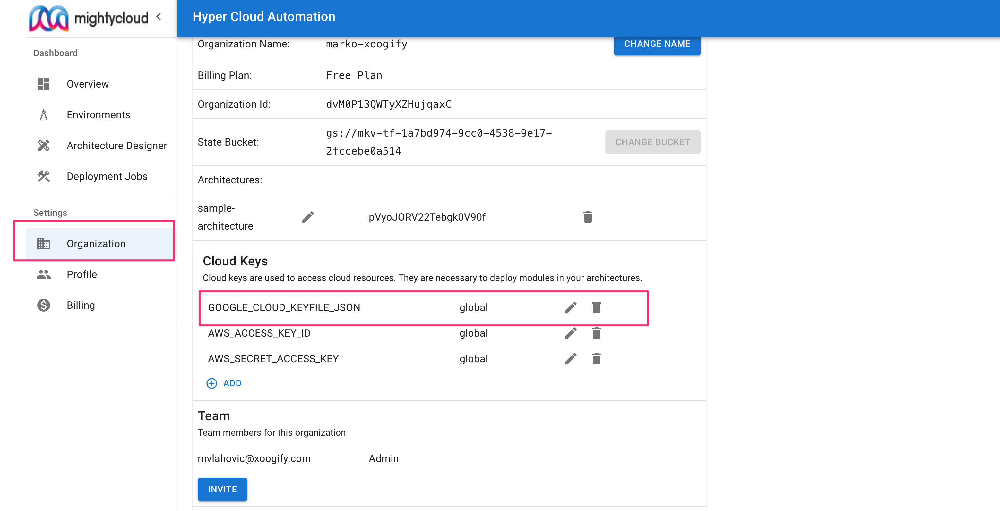
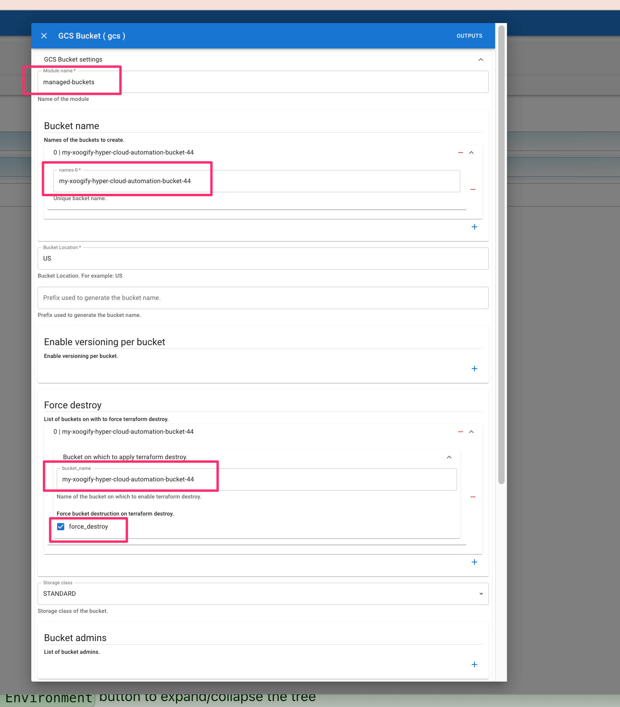
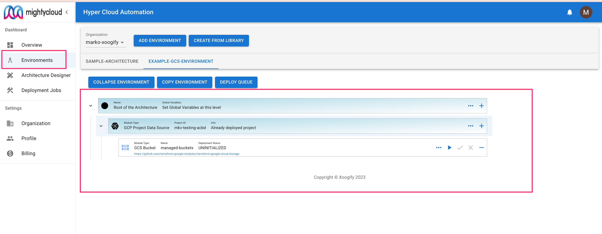
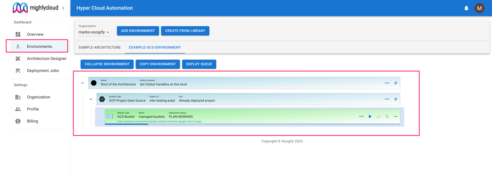
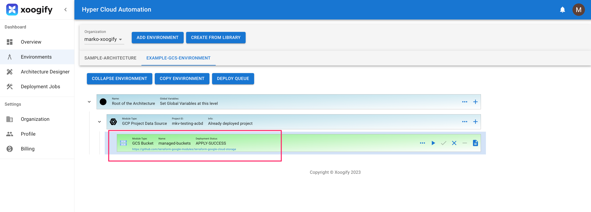
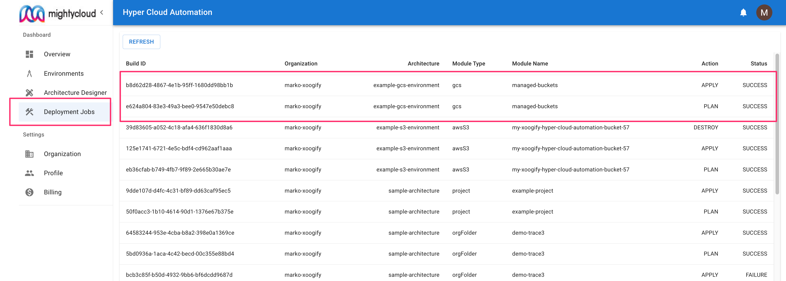
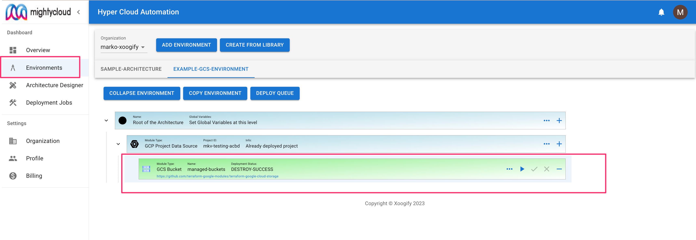

import {
PlayArrow,
MoreHoriz,
Remove,
Add,
Clear,
Description,
Check,
} from "@mui/icons-material";

# GCP Example: deploy GCS bucket

In this quick start we will show you how you can use `Hyper Cloud Automation` to deploy a GCS bucket as a part of a simple architecture. The example will walk you through creating a simple environment, adding a module, and deploy it.

## Prerequisite

For this example we will assume that you already have a GCP project created.

1. Go to your cloud shell https://shell.cloud.google.com/
1. Create service account: `gcloud --project <YOUR_PROJECT_ID> iam service-accounts create mighty-example`
1. Grant `Storage Admin` role to the account: `gcloud projects add-iam-policy-binding <YOUR_PROJECT_ID> --member serviceAccount:mighty-example@<YOUR_PROJECT_ID>.iam.gserviceaccount.com --role roles/storage.admin`
1. Create a service account key: `gcloud --project <YOUR_PROJECT_ID> iam service-accounts keys create credentials.json --iam-account mighty-example@<YOUR_PROJECT_ID>.iam.gserviceaccount.com`
1. Note down the value of the key by doing `cat credentials.json`
1. In the Hyper Cloud Automation click on [Organization](../Concepts/Organization.md) in the left hand navigation menu.
1. Scroll to the [Cloud Keys](../Concepts/Organization.md#cloud-keys) section.
1. Press on `+Add` button.
1. For `Cloud Key` choose `GOOGLE_CLOUD_KEYFILE_JSON`.
1. Paste the value of the `credentials.json` in the above steps
1. For `Environment` choose `global`.
1. Press `Save` button
1. You should have something like this
   

## Create environment

In this example we will create a simple environment which consist of a module that deploys a GCS bucket.

1. In the left naviation menu select `Environments`
1. Click on `Add Environment`
1. Name your environment `example-gcs-environment`
1. Press `Add`
1. Select `EXAMPLE-GCS-ENVIRONMENT` in the tabs
1. Press on the `+` button in the `Root of the Environment`
1. Select `GCP Project Data Source` [Data Source](../Concepts/DataSource.md)
   :::tip
   Press `Expand Environment` button to expand/collapse the tree
   :::
1. In the `GCP Project Data Source` node press on the <MoreHoriz width="30"/> button and fill in the `Project ID` with the value of `<YOUR_PROJECT_ID>` from the [Prerequisites](#prerequisite) section
1. Press `Save`
1. On `GCP Project Data Source` node press <Add width="30"/> and select `GCS Bucket` [Module](../Concepts/Module.md)
1. Click on <MoreHoriz width="30"/> button and set the settings like in this image
   
1. Scroll down and press `Save`.

Your first simple environment should look something like this:

## Deploy

Deployment process consists of running a `plan` action folowed by approval process and then running `apply`

1. In your environment locate `GCS Bucket` module
1. Press on the <PlayArrow width="30" /> in the module to start the `plan`. Notice that the `Deployment Status` will change.
   
1. Once the `Deployment Status` is changed to `PLAN SUCCESS` click on <Check width="30"/> button to pop up the deployment `PLAN`
1. In the top right corner press `TERRAFORM-APPLY` button
1. Wait for deployment to finish.
   
1. Go to your GCP Cloud Console
1. Go to Cloud Storage
1. You will find the bucket that has been deployed

To review deployments log do:

1. In the left navigation menu click on `Deployment Jobs`
1. Click on the deployment job IDs to see the full logs
   

## Destroy the bucket

1. In the naviagion menu on the left select `Environments`
1. In the tabs select `EXAMPLE-GCS-ENVIRONMENT`
1. Click on `Expand Environment`
1. Click on <Clear width="30" /> button on the `GCS Bucket` module.
1. Confirm the destruction plan
1. Wait for `Destroy` to complete
   
1. Go to your GCP Cloud Console
1. Go to Cloud Storage
1. The bucket is deleted

## Cleanup

1. In the left navigation menu click on `Organization`
1. Delete the environment `EXAMPLE-GCS-ENVIRONMENT`. See also [delete envrionment](../Concepts/Organization.md#renamedelete-envrionments)
1. Delete the Service Account Key created in [prerequisite](#prerequiste)
