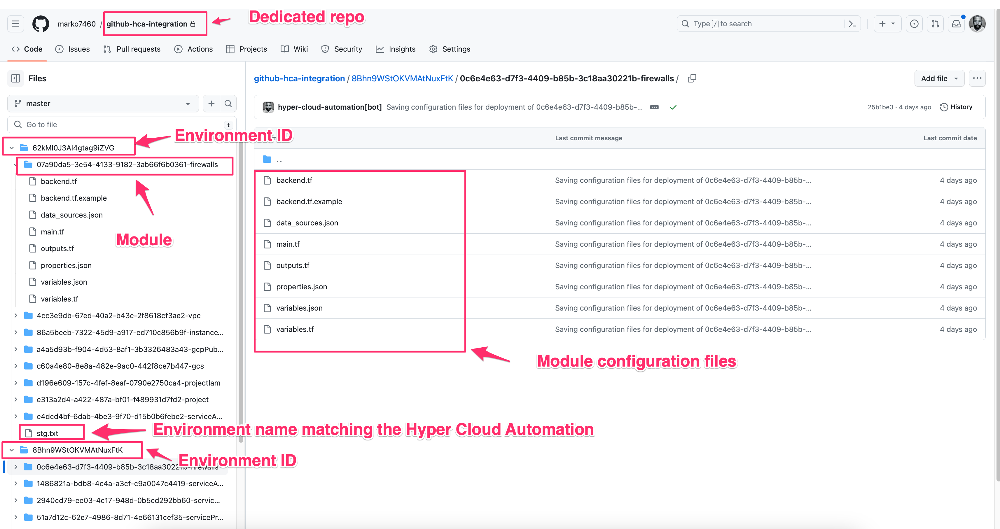
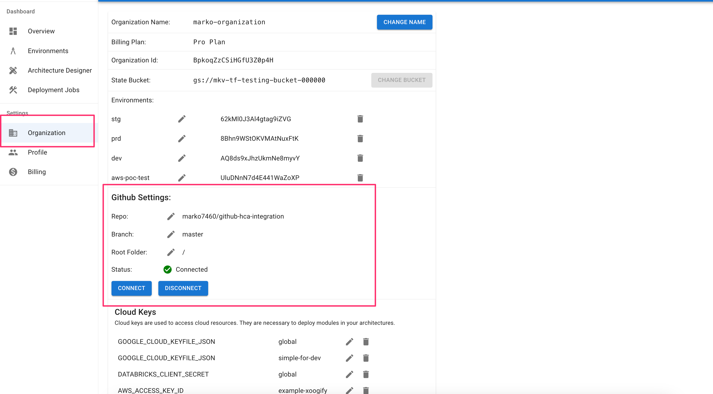

import AppUrl from '@site/src/components/AppUrl';

# Github Integration

You can setup integration between Hyper Cloud Automation tool and a github. When this integration is setup the Hyper Cloud Automation will git commit the latest applied changes when a [Module](./Concepts/Module.md) in [applied](./Concepts/Module.md#terraform-apply). If the module gets [destroyed](./Concepts/Module.md#terraform-destroy).
:::info
It is highly recommended that you setup Github integration in order to save your deployment configurations. In case the Hyper Cloud Automation ever goes down your environment configurations will be available to you through the Github Rpeos
:::

:::warning
Only one Github repo per organization is allowed. Only the Admin can setup the github integration.
:::

Once the integration is set, the module configurations will be saved in the form:

```
<env_id>/<module_id>-<module_type>/*.tf
<env_id>/<module_id>-<module_type>/*.json
```

Example structure created by Hyper Cloud Automation:


## Prerequisite

1. Github account.
1. Dedicated github repository. We recommend creating a new empty repository
1. Permissions to install Github apps in your account or organization account.
1. Admin permissions in Hyper Cloud Automation tool.

## Setup

1. Install the following Github app in your account or organization: https://github.com/apps/hyper-cloud-automation
1. Allow this Github application access only to the dedicated repository created in the [Prerequisite](#prerequisite) section.
1. Log in as administrator to [<AppUrl />](<AppUrl />)
1. In the left navigation bar click on [Organization](./Concepts/Organization.md)
1. In the Github Settings set:
   1. **Repo:** Your dedicated github repo
   1. **Branch:**: Branch to which the Hyper Cloud Automation will push the module configurations (Usually this is either `master` or `main`)
   1. **Root Folder:**: Root directory that will prefix the environment folders.
   1. 
1. Press Connect button. If everything is set properly you will see a green checkmark saying **Status:** Connected.
   :::warning
   You must install https://github.com/apps/hyper-cloud-automation for integration to work
   :::

## Post setup

Go to some of your environments and re-apply some modules. Monitor your github repo for changes.
